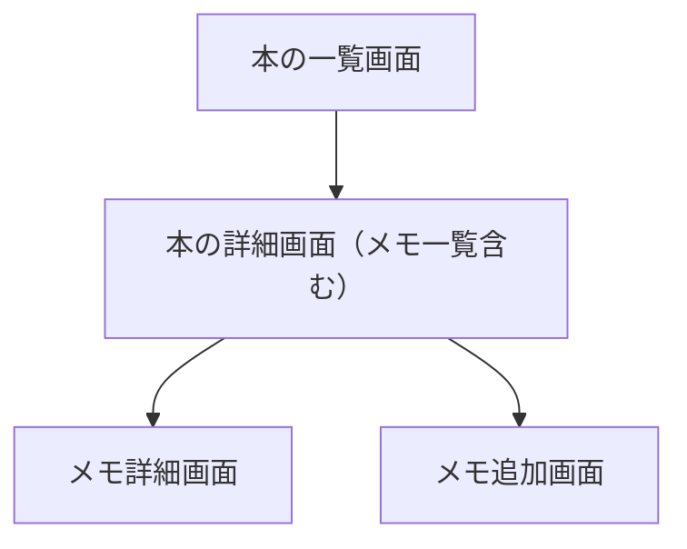

# 読書メモアプリ 設計ドキュメント

## 1. アプリの目的・概要
- スマホ・PC両対応のレスポンシブWebアプリ
- 書籍やWebページなど、ISBNの有無を問わず管理
- 本を読みながら、OCRやバーコードスキャン、画像添付（※拡張予定）でメモや感想を記録
- 全文検索で過去のメモや書籍情報を横断的に検索（現状はクライアントサイド検索で実装）
- ユーザー認証（個人利用・複数ユーザー対応）

## 2. 技術スタック
- フロントエンド：React（Vite推奨）、React Router、Material-UI等
- データベース：Firebase Firestore
- 画像保存：Firebase Storage（※今後の拡張）
- 認証：Firebase Authentication（メール＋パスワード）
- OCR：Tesseract.js（クライアントサイド）
- バーコードスキャン：zxing-js/library
- デプロイ：GitHub Pages または Firebase Hosting
- PWA化・Algolia等は今後の拡張で検討

## 3. 主な機能一覧
- 書籍・資料管理（ISBNバーコードスキャン or 手入力、書誌情報自動取得、ステータス管理）
- メモ・感想管理（OCRテキスト、感想、ページ番号、タグ付与）
- 検索・一覧（全文検索、タグ・著者・期間等での絞り込み）
- 認証・ユーザー管理（Firebase Authentication、データ分離）
- PWA対応（※今後の拡張）
- タグ履歴・サジェスト（詳細はAppendix参照）

## 4. データ構造・設計方針

### 書籍（booksコレクション）
- ユーザーごとにFirestoreのbooksコレクションで管理
- ISBNの有無にかかわらず登録可能
- タグ配列はAPI自動セット＋履歴サジェスト＋ユーザー編集可

```json
{
  "id": "自動生成ID",
  "userId": "ユーザーID",
  "isbn": "978-4-xx-xxxxxx-x", // 無い場合はnull
  "title": "タイトル",
  "author": "著者",
  "publisher": "出版社",
  "publishedDate": "2024-01-01",
  "coverImageUrl": "https://...", // 書影URL
  "tags": ["小説", "名作"], // タグ配列
  "status": "reading" or "finished",
  "createdAt": "...",
  "updatedAt": "..."
}
```

### メモ（books/{bookId}/memosサブコレクション）
- 書籍ごとに複数のメモを管理
- OCRテキスト・感想・ページ番号・タグを保存

```json
{
  "id": "自動生成ID",
  "text": "OCRや引用テキスト",
  "comment": "感想",
  "page": 123,
  "tags": ["名言", "感想"],
  "createdAt": "...",
  "updatedAt": "..."
}
```

### タグ履歴
- 書籍用・メモ用でFirestoreコレクションを分離
- サジェスト・補完候補として利用
- 詳細設計・運用TipsはAppendix参照

### ユーザー・履歴系（usersコレクション）
- 各ユーザーの設定や履歴情報は `users/{userId}` ドキュメントおよびサブコレクションで管理
- タグ履歴（bookTagHistory, memoTagHistory）、個人設定、検索履歴などを用途ごとに分離
- サブコレクションの詳細はAppendix参照

```json
// usersコレクション
{
  "id": "ユーザーUID",
  "email": "testuser@example.com",
  "displayName": "テストユーザー",
  "createdAt": "...",
  "settings": {
    "theme": "dark",
    "notification": true
  }
}
```

## 5. 画面・UI構成と画面遷移

- ログイン画面（新規登録・パスワードリセット）
- 本の一覧画面（読書中・読了タブ、サムネイル・タイトル・著者表示、追加ボタン）
- 本の追加画面（ISBN入力・バーコードスキャン・自動取得・手入力）
- 本の詳細画面（書影・書誌情報・メモ一覧・メモ追加ボタン・ステータス変更）
- メモ追加画面（OCR→感想・ページ番号入力）
- メモ詳細画面（引用・感想・編集・削除）
- 全文検索画面（書籍・メモ横断検索）
- 設定画面（アカウント情報・ログアウト・データエクスポート等）
- タグ管理・検索ページ（詳細仕様はAppendix参照）

### 画面遷移図



- 本の一覧 → 本の詳細（その本のメモ一覧） → メモ詳細 or メモ追加

## 6. 運用・デプロイ方針
- GitHub PagesまたはFirebase Hostingで無料公開
- 本番・ステージング環境を分けて運用
- ステージングで十分にテスト・確認後、本番環境に反映
- デプロイ手順や環境構築の詳細はAppendix参照

## 7. テスト・開発運用
- React Testing Library＋Jestでユニットテスト
- CypressによるE2Eテストは「1ファイル＝1シナリオ（単体実行）」運用とし、テストごとに状態が独立するように設計
- テスト安定化の工夫やTipsはAppendix参照
- 設計ドキュメント（本ファイル）を常に参照し、開発再開時の指針とする

### テスト実装方針（2024-07-20追記）

#### テスト要素の特定方法
- **data-testid属性による決定的な要素特定**: すべてのテスト対象要素には `data-testid` 属性を付与し、テストでは `cy.get('[data-testid="element-name"]')` を使用
- **テキストベースの要素特定の回避**: `cy.contains()` や `getAllByText()` などのテキストベースの要素特定は避け、UI変更に影響されない安定したテストを実装
- **一貫性の確保**: テスト要素の命名規則を統一し、保守性を向上

#### 実装パターン
- **Test ID Pattern**: テスト専用のID属性を使用した要素特定
- **Semantic Test Selectors**: 意味のあるセレクタ名による要素特定
- **Stable Test Selectors**: UI変更に影響されない安定したセレクタの使用

#### 命名規則
- 要素の役割を明確に表現: `login-email-input`, `book-add-submit`, `memo-detail-title`
- 階層構造を反映: `memo-edit-button`, `memo-delete-confirm-button`
- 一意性を保証: 同じ機能の要素でも異なるコンテキストでは異なるID

### E2Eテスト運用の教訓・安定化の工夫（2024-06-27追記）

- UI/UXの大きな変更時は、E2Eテスト修正工数も見積もりに含める。
- テスト前にFirestore等のテストデータをリセットし、毎回同じ状態からテストを開始する。
- 重要なボタンや入力欄にはdata-testidを付与し、セレクタの堅牢性を高める。
- Cypressのactionabilityエラー（要素がhidden/覆われている等）は、`{force: true}`や`should('be.visible')`等で適切に回避。
- 1ファイル1シナリオの分割運用により、各テストの独立性・安定性を確保する。
- テスト設計方針（分割・独立性重視）はチームで共有し、迷ったら本ドキュメントを参照する。

## 8. 開発環境・コマンドシェルの前提
- 本プロジェクトの開発・運用時はWindows PowerShellを標準のコマンドシェルとする
- コマンド例やスクリプト、環境変数の指定方法もPowerShell前提で記載・運用
- 他のシェル（bash等）を使う場合は、適宜コマンドの書き換えが必要

## 9. 制約事項・今後の拡張
- Firebase Storageの無料枠では新規バケット作成不可のため、画像添付・アップロード機能は現時点で未実装
- Blazeプラン移行や他サービス利用時に画像添付機能を拡張予定
- Algolia等の全文検索サービス、PWA化、タグ分析機能なども今後の拡張候補

## 10. 補足・詳細仕様・FAQ（Appendix）

### タグ履歴のFirestore設計
- 書籍用タグ履歴: `users/{userId}/bookTagHistory`
- メモ用タグ履歴: `users/{userId}/memoTagHistory`
- 用途ごとにコレクションを分離し、サジェスト・補完候補として利用
- 保存・取得ロジックも用途ごとに分離実装

```json
// bookTagHistory, memoTagHistory 共通
{
  "id": "自動生成ID",
  "tag": "技術書",
  "createdAt": "...",
  "updatedAt": "..."
}
```

### タグ入力UIの詳細
- 書籍追加・編集時のタグ入力欄には、Google Books APIの`categories`をデフォルトで自動セット
- 取得できない場合はopenBDの`subject`や`ndc`も利用
- MUIのAutocomplete（multiple）を利用し、履歴サジェスト・補完候補を表示
- API由来の標準化タグとユーザー独自タグの両立を実現

### E2Eテスト安定化の工夫
- **開発サーバーの起動**: E2Eテスト実行前には必ず`npm run dev`で開発サーバーを起動
- テスト前にFirestore等のテストデータをリセットし、毎回同じ状態からテストを開始
- 重要なボタンや入力欄にはdata-testidを付与し、セレクタの堅牢性を高める
- Cypressのactionabilityエラー（要素がhidden/覆われている等）は、`{force: true}`や`should('be.visible')`等で適切に回避
- 1ファイル1シナリオの分割運用により、各テストの独立性・安定性を確保
- テスト設計方針（分割・独立性重視）はチームで共有し、迷ったら本ドキュメントを参照

### その他運用Tips
- 設計ドキュメントは常に最新化し、開発再開時の指針とする
- 詳細仕様や運用ノウハウはAppendixに集約し、他章からは参照のみとする

## 11. 今後の開発課題・TODO（2025-08-12更新）

### ローカルテスト実行の方針
- **目的**: すべてのテストをローカル環境で実行し、課金リスクを排除
- **実行方法**:
  - ユニットテスト: `npm run test:unit` または `npm test`
  - E2Eテスト: `npm run test:e2e` または `npm run e2e`
  - 全テスト実行: `npm run test:all`
  - E2Eテスト（GUI）: `npm run test:e2e:open`
  - テスト用ユーザー設定: `npm run test:setup`
- **ローカル実行の利点**:
  - 課金リスクの完全排除
  - 開発環境での直接的なデバッグ
  - テスト実行時間の短縮
  - ネットワーク依存の排除
- **注意事項**:
  - ローカル環境でのFirebase設定が必要
  - `serviceAccountKey.json`の適切な管理
  - **E2Eテスト実行前には必ず開発サーバー（`npm run dev`）を起動**
  - テスト実行前の環境確認

### 技術的課題・TODOリスト
- [x] BookForm: ISBN取得ボタンのevent混入防止・テストの型問題修正（[object Object]解消）、ユニットテスト安定化
- [x] MemoCard.test.jsxの修正（スワイプアクション対応）✅ **完了**
- [x] MemoList.test.jsxの再作成（FAB・クリック機能対応）✅ **完了**
- [x] E2Eテストの安定性向上・追加（memo_swipe_actions.cy.js等）✅ **完了**
- [ ] ユニットテストのカバレッジ向上
- [x] 共通フック（useBook, useMemo）の作成・適用 ✅ **Phase 7完了**
- [ ] アクセシビリティ改善（ARIA属性、キーボードナビ等）
- [ ] Pull to Refreshの実装
- [ ] アニメーション効果の追加
- [x] レスポンシブデザインの改善 ✅ **Phase 8完了**
- [x] コンポーネントの最適化 ✅ **Phase 8完了**
- [ ] バンドルサイズの削減
- [ ] BarcodeScannerテストの安定化（現在スキップ中）
- [x] React act()警告の解消 ✅ **完了**
- [x] MUI Grid警告の解消 ✅ **完了**

### 機能拡張・改善案
- [x] **メモOCR機能の実装（基本版）** ✅ **Phase 9完了**
  - iPhoneカメラOCR + ペースト機能の実装
  - CameraPasteOCRコンポーネントの作成
  - メモ追加フォームへの統合
  - 技術的制限の回避（iOS Safariの制限対応）
- [ ] **本番デプロイ環境の構築** 🔄 **Phase 10基盤完了**
  - 本番Firebaseプロジェクト作成（project-01-bookmemo-prod）
  - GitHub Actionsワークフロー作成
  - 本番デプロイガイド作成
  - 残り作業: Firestore Database作成、環境変数設定、GitHub Secrets設定
- [x] **セキュリティ問題の修正** ✅ **Phase 11完了**
  - `.env`ファイルのGitコミット問題を発見・修正
  - Git履歴から機密情報を完全に除去
  - セキュリティ警告と管理手順をドキュメントに追加
- [ ] 統計・ダッシュボード機能の設計・技術調査
- [ ] 全文検索機能の実装
- [ ] 画像添付機能（Firebase Storage Blazeプラン移行後）
- [ ] PWA化（オフライン対応・プッシュ通知）
- [ ] 他サービス連携（CSV/Excel出力、他読書管理サービスとの連携）
- [ ] **将来タスク: OCR機能の拡張** 🔄 **サスペンド中**
  - Tesseract.jsベースのOCR機能（非iPhone Safari対応）
  - E2Eテストの追加
  - リアルタイムOCR機能（カメラストリームからの直接認識）
  - 多言語OCR対応（日本語以外の言語）
  - OCR精度向上機能（画像前処理、後処理）

### E2Eテスト安定化の工夫（2025-08-12追記）
- UI/UXの大きな変更時は、E2Eテスト修正工数も見積もりに含める。
- テスト前にFirestore等のテストデータをリセットし、毎回同じ状態からテストを開始する。
- 重要なボタンや入力欄にはdata-testidを付与し、セレクタの堅牢性を高める。
- Cypressのactionabilityエラー（要素がhidden/覆われている等）は、`{force: true}`や`should('be.visible')`等で適切に回避。
- 1ファイル1シナリオの分割運用により、各テストの独立性・安定性を確保する。
- テスト設計方針（分割・独立性重視）はチームで共有し、迷ったら本ドキュメントを参照する。
- カスタムコマンドやテストヘルパー（スワイプ・タップ操作の共通化）を活用し、テストの保守性・安定性を向上。 

## 12. セキュリティ重要事項（2025-08-12追加）

### 環境変数ファイルの管理
- **絶対にGitにコミットしない**: `.env`、`.env.local`、`.env.development`、`.env.production`、`.env.test`
- **`.gitignore`の確認**: 環境変数ファイルが含まれていることを必ず確認
- **機密情報の漏洩リスク**: APIキー、パスワード、トークン等の漏洩は重大なセキュリティ問題

### セキュリティチェック手順
開発開始時およびコミット前に以下を実行：
```bash
# 環境変数ファイルがGit管理されていないか確認
git ls-files | grep -E "\.env"

# 機密情報が含まれていないか確認
git log --all --full-history -- "*.env"
```

### 環境変数の適切な管理
- **ローカル開発**: `.env.local`（Git管理外）
- **本番環境**: GitHub Secrets
- **チーム共有**: `.env.example`テンプレート
- **テスト環境**: `.env.test`（Git管理外）

### 既にコミットされた機密情報の対処
機密情報がGitにコミットされた場合：
1. 即座に`git rm --cached <file>`で削除
2. `git filter-branch`で履歴から完全削除
3. 強制プッシュでリモートリポジトリも更新
4. 漏洩した機密情報は即座に再発行

### 実際のセキュリティ修正事例（2025-08-12）
- **問題**: `.env`ファイルがGitにコミットされていた
- **対応**: `git filter-branch`を使用して163個のコミットから`.env`ファイルを完全削除
- **結果**: 機密情報の漏洩リスクを完全に排除
- **再発防止**: `.gitignore`に環境変数ファイルを追加、セキュリティ警告をドキュメントに追加 