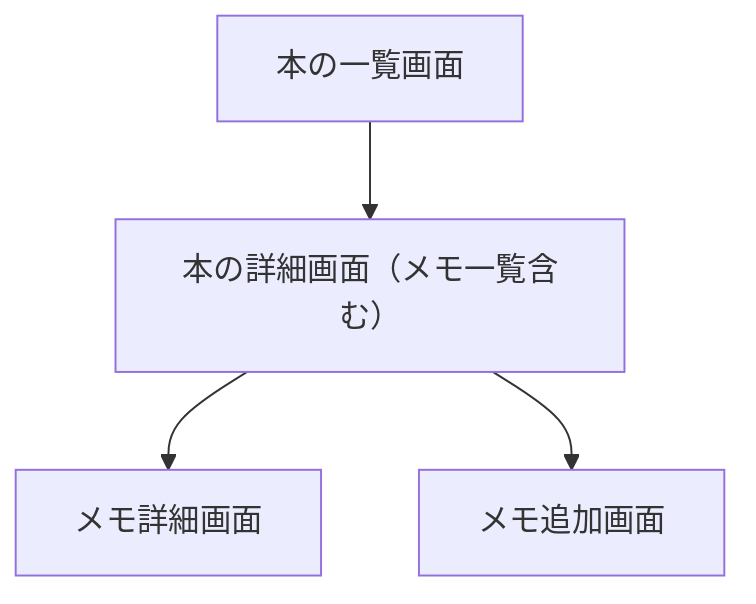

# 読書メモアプリ 設計ドキュメント

## 1. アプリの目的・概要
- スマホ・PC両対応のレスポンシブWebアプリ
- 書籍やWebページなど、ISBNの有無を問わず管理
- 本を読みながら、OCRやバーコードスキャン、画像添付（※拡張予定）でメモや感想を記録
- 全文検索で過去のメモや書籍情報を横断的に検索（現状はクライアントサイド検索で実装）
- ユーザー認証（個人利用・複数ユーザー対応）

## 2. 技術スタック（`package.json` に即した現状）
- **フロントエンド**: React 19、Vite 6、`react-router-dom` 7（ルータは `HashRouter`）
- **UI**: MUI（`@mui/material` 7 系、`@mui/x-charts`、`@mui/x-date-pickers`）、Emotion
- **データ・認証**: Firebase 11（Firestore、Authentication／メール＋パスワード）
- **その他**: axios、date-fns、**Tesseract.js**（OCR）、**@zxing/library**（ISBN スキャン）
- **デプロイ**: **GitHub Pages**（リポジトリパス配下：`base: '/project-01-bookmemo/'`）。Firebase Hosting は運用上の選択肢として README に記載あり
- **PWA**: **実装済み**（Service Worker、Web App Manifest、オフライン時の静的キャッシュ。詳細は §3.2）
- **全文検索**: **Algolia 等は未使用**。Firestore からの取得結果をクライアント側で検索し、LocalStorage キャッシュとレート制限で負荷を抑制（§3.3）
- **画像・ファイル**: Firebase Storage は**未接続**（無料枠・プラン制約により画像添付は拡張候補）

### 2.1. 開発環境・テスト
- ビルド：Vite（`npm run dev` / `npm run build`）
- テスト：Jest + React Testing Library（`npm run test:unit`）、Cypress（`npm run test:e2e`、事前に dev サーバー起動）
- 環境変数：オプションでは Vite（`import.meta.env`）。**`src/utils/logger.js` は Jest 互換のため `process.env` 経由**で本番判定（`vite.config.js` の `define` で埋め込み）
- 外部 API：Google Books API、OpenBD API（キーは環境変数／Secrets で管理）

## 3. 主な機能一覧
- 書籍・資料管理（ISBNバーコードスキャン or 手入力、書誌情報自動取得、ステータス管理）
- 書籍ステータス履歴（ステータス変更の履歴をタイムライン表示）
- 手動ステータス履歴追加（既存書籍への過去ステータス履歴追加、自動ステータス更新）
- メモ・感想管理（OCRテキスト、感想、ページ番号、タグ付与、★評価）
- 検索機能
  - **全文検索タブ**（シンプル検索、LocalStorageキャッシュ、レート制限）
  - **詳細検索タブ**（タグ・著者・期間・メモ内容での絞り込み）
  - **タグ管理タブ**（タグ統計・編集・削除・統合）
- 統計・ダッシュボード（@mui/x-chartsでグラフ表示）
- 認証・ユーザー管理（Firebase Authentication、データ分離）
- PWA対応（オフライン対応、インストール機能）
- タグ履歴・サジェスト（詳細はAppendix参照）

### 3.1 設定・テーマ・プロフィール（実装の外観）

| 観点 | 実装の所在・要点 |
|------|------------------|
| **ルーティング** | `HashRouter`。`/settings` はボトムナビの PersonIcon から遷移（`App.jsx`） |
| **状態・永続化** | `UserSettingsProvider` / `useUserSettings`（`src/hooks/useUserSettings.jsx`）。ドキュメント `doc(users/{uid})` に読み書き |
| **データ形状** | `profile`（例: `displayName`, `avatarUrl`）、`preferences`（例: `themePresetId`, `themeMode`）。既定値は `src/constants/userSettings.js` の `DEFAULT_USER_SETTINGS` |
| **テーマ適用** | `ThemeProviderWithUserSettings` が Firestore のプリセット ID とモードを反映し、`createThemeFromPreset` で MUI テーマを生成（`src/theme/createThemeFromPreset.js`） |
| **プリセット** | `src/theme/themePresets.js`（例: `library-classic`, `slim-compact` など）。スリム系は `theme.custom.layout` で一覧・検索・統計グリッドの列数・`gap` をテーマ化（`BookList`, `SearchResults`, `Stats`, `TagStats`, `DateRangeSelector` が参照） |
| **カードの見た目** | `src/theme/cardStyles.js`（`getBookCardSx` / `getMemoCardSx`）。書籍／メモで `bookAccent` / `memoAccent` と装飾トークン（`palette.decorative`、`theme.custom` の sizes / motion 等）を参照 |
| **ダークモード** | `preferences.themeMode`（`'normal'` \| `'dark'`）で明／暗の切り替え（プリセット＋モードの組み合わせで `createThemeFromPreset` が生成） |

新テーマやトークン追加の一覧は `doc/design-system-overview.md` も参照。

### 3.2 PWA（実装済み）

- **`usePWA.js`**: Service Worker の登録・更新検知、インストール可能時の制御
- **`PWAInstallPrompt.jsx`**: インストール UI。**起動時の自動表示はオフ**（手動導線はバックログで検討）
- **マニフェスト**: `public/manifest.webmanifest`（アイコン、`theme_color` 等）
- **キャッシュ**: precaching / ランタイムキャッシュの方針は Phase 8 以降の実装に準拠（静的リソース優先、API はネットワーク寄り）

### 3.3 全文検索（クライアントサイド・Firebase 直）

- **UI**: `src/components/search/FullTextSearch.jsx`（`TagSearch` ページの「全文検索」タブ）
- **フック**: `useFullTextSearch.js` — Firestore からユーザーの本／メモを取得し、クライアントでヒット判定
- **キャッシュ**: `useSearchCache.js` + LocalStorage（キー生成・TTL・サイズ上限は `src/config/fullTextSearchConfig.js` 周辺で調整）
- **レート制限**: `useSearchRateLimit.js`（連打・短時間の再検索を抑制）
- **方針**: ボタン実行型の検索（入力のたびに走らせない）。Algolia 等への移行は別要件。

### 3.4 詳細検索・タグ検索・結果の保持

- **詳細検索**: `useSearchQuery` / `useSearchExecution` / `useSearchResults`（`src/hooks/useSearch*.js`）に分割。条件はタグ・著者・日付・メモ本文など
- **結果のセッション保持**: `src/utils/searchStorage.js`（sessionStorage、TTL）。`useNavigation.js` と組み合わせ、書籍詳細から戻ったときに検索結果を復元可能

### 3.5 ナビゲーション・ジェスチャ

- **`useNavigation.js`**: 戻る動作、検索状態の保存／復元、ルート履歴に応じた制御
- **`App.jsx`**: PWA 時などグローバルなスワイプで戻る処理（タッチ開始位置の判定でリスト内スワイプと競合回避）。メモ一覧では `MemoCard` の `data-allow-local-swipe` 等で局所ジェスチャを許可

### 3.6 ロギング・エラー

- **`src/utils/logger.js`**: `devLog`（本番ビルドでは原則無出力）、`logger`（レベル・カテゴリ付き）。`VITE_LOG_LEVEL` / `VITE_DEBUG_LOGS` で調整可能
- **`src/utils/errorLogger.js`**: グローバルエラーハンドラ、ローカルストレージへのエラーログ、ブラウザコンソール用デバッグコマンド（`bookmemoDebug.*`）

### 3.7 `src/` ディレクトリ責務（新規機能を置く際の目安）

| パス | 内容 |
|------|------|
| `auth/` | `AuthProvider`, Login, Signup |
| `pages/` | 画面単位（BookList, BookDetail, TagSearch, Stats, Settings, …） |
| `components/` | 再利用 UI。`search/`, `tags/`, `common/` にサブ分類 |
| `hooks/` | Firestore・検索・PWA・設定などのロジック |
| `theme/` | `themePresets.js`, `createThemeFromPreset.js`, `cardStyles.js`, `fallbacks.js` |
| `config/` | `paths.js`（本番ベースパス等）、`fullTextSearchConfig.js` |
| `utils/` | 汎用処理・ストレージ・テキスト・ログ |
| `constants/` | `bookStatus.js`, `userSettings.js`, `memoRating.js` 等 |

## 4. データ構造・設計方針

### 書籍（booksコレクション）
- ユーザーごとにFirestoreのbooksコレクションで管理
- ISBNの有無にかかわらず登録可能
- タグ配列はAPI自動セット＋履歴サジェスト＋ユーザー編集可

```json
{
  "id": "自動生成ID",
  "userId": "ユーザーID",
  "isbn": "978-4-xx-xxxxxx-x", // 無い場合はnull
  "title": "タイトル",
  "author": "著者",
  "publisher": "出版社",
  "publishedDate": "2024-01-01",
  "coverImageUrl": "https://...", // 書影URL
  "tags": ["小説", "名作"], // タグ配列
  "status": "tsundoku" or "reading" or "suspended" or "re-reading" or "finished",
  "acquisitionType": "bought" or "borrowed" or "gift" or "unknown",
  "createdAt": "...",
  "updatedAt": "...",
  "finishedAt": "..." // 読了時のみ設定
}
```

### メモ（books/{bookId}/memosサブコレクション）
- 書籍ごとに複数のメモを管理
- OCRテキスト・感想・ページ番号・タグを保存

```json
{
  "id": "自動生成ID",
  "text": "OCRや引用テキスト",
  "comment": "感想",
  "page": 123,
  "tags": ["名言", "感想"],
  "rating": 0,
  "createdAt": "...",
  "updatedAt": "..."
}
```

- `rating`: ★評価（未設定や旧データは `DEFAULT_MEMO_RATING` で補完。`src/constants/memoRating.js`）

### ステータス履歴（books/{bookId}/statusHistoryサブコレクション）
- 書籍のステータス変更履歴を管理
- 変更時刻、前のステータス、新しいステータスを記録
- 手動履歴追加機能で過去の履歴も追加可能
- 最新履歴追加時に書籍ステータスを自動更新

```json
{
  "id": "自動生成ID",
  "status": "読書中",
  "previousStatus": "積読",
  "changedAt": "2024-09-20T10:30:00Z",
  "userId": "ユーザーID"
}
```

### 手動ステータス履歴追加機能
- **ManualHistoryAddDialog**: 過去日時での履歴追加ダイアログ
- **LatestStatusHistory**: 最新履歴の表示コンポーネント
- **dateUtils**: Firestore Timestamp変換ユーティリティ
- **自動ステータス更新**: 最新日時の履歴追加時に書籍ステータスを自動更新

### タグ履歴
- 書籍用・メモ用でFirestoreコレクションを分離
- サジェスト・補完候補として利用
- 詳細設計・運用TipsはAppendix参照

### ユーザー・履歴系（usersコレクション）

- **ルート文書** `users/{userId}`: アプリが `setDoc`/`getDoc` で読み書きする **profile / preferences** を格納（認証 UID ＝ ドキュメント ID）。タグ履歴サブコレクションと同じドキュメントツリー上に共存しうる
- **サブコレクション**: `bookTagHistory`, `memoTagHistory`（タグサジェスト用。Appendix 参照）

実装上の主フィールド（未定義時は `DEFAULT_USER_SETTINGS` で補完）:

```json
// users/{uid} （アプリが管理する主要フィールドの例）
{
  "profile": {
    "displayName": "",
    "avatarUrl": ""
  },
  "preferences": {
    "themePresetId": "library-classic",
    "themeMode": "normal"
  },
  "updatedAt": "Firestore Timestamp"
}
```

- メール・UID といった **認証素性**は Firebase Authentication 側が主。Firestore には必須ではない
- 旧ドキュメントで例示していた `settings.theme` 単体形式は**廃止**（上記 profile / preferences へ移行済み）

## 5. 画面・UI構成と画面遷移

- ログイン画面（新規登録・パスワードリセット）
- 本の一覧画面（読書中・読了タブ、サムネイル・タイトル・著者表示、追加ボタン）
- 本の追加画面（ISBN入力・バーコードスキャン・自動取得・手入力）
- 本の詳細画面（書影・書誌情報・メモ一覧・メモ追加ボタン・ステータス変更）
- メモ追加画面（OCR→感想・ページ番号入力）
- メモ詳細画面（引用・感想・編集・削除）
- 検索・タグ画面（3タブ構成：全文検索・詳細検索・タグ管理）
- 設定画面（`/settings`：プロフィール編集、テーマプリセット／明・暗モード選択、ログアウト、アカウント表示、その他設定）
- タグ管理・検索ページ（詳細仕様はAppendix参照）

### 画面遷移図


```mermaid
graph TD
  A["本の一覧画面"] --> B["本の詳細画面（メモ一覧含む）"]
  B --> C["メモ詳細画面"]
  B --> D["メモ追加画面"]
```

- 本の一覧 → 本の詳細（その本のメモ一覧） → メモ詳細 or メモ追加

## 6. 運用・デプロイ方針
- GitHub PagesまたはFirebase Hostingで無料公開
- 本番・ステージング環境を分けて運用
- ステージングで十分にテスト・確認後、本番環境に反映
- デプロイ手順や環境構築の詳細はAppendix参照

### 6.1 GitHub Pages（本番デプロイ）の構成
- CI: GitHub Actions（`.github/workflows/deploy.yml`）
- ビルド: Vite（`vite build`）。本番時は `vite.config.js` の `base` が `'/project-01-bookmemo/'` に切り替わり、Pages配信パスへ最適化
- 公開: `peaceiris/actions-gh-pages@v3` で `dist/` を `gh-pages` ブランチに公開
- 権限: ワークフローに `permissions: contents: write` を付与。`actions/checkout` は `persist-credentials: false`
- ブランチ: `gh-pages` はビルド成果物のみを保持。通常は orphan push（`main` と履歴は結合されない）

### 6.2 ワークフロー構成
- job: test（全PR/`main` push 対象）
  - `npm ci`
  - `npm run test:unit`
  - （任意）E2E: 変数 `RUN_E2E == 'true'` の場合のみ実行
    - Secrets から `.env.local` を生成（Firebaseクライアント設定）
    - `SERVICE_ACCOUNT_KEY_JSON` があれば `serviceAccountKey.json` を生成
    - `npm run dev` をバックグラウンド起動 → `npm run test:e2e`
- job: build-and-deploy（`main` への push 時のみ）
  - Secrets から `.env.production` を生成
  - `npm run build`
  - `peaceiris/actions-gh-pages` で `dist/` を `gh-pages` へ公開

### 6.3 Secrets / Variables（GitHub）
- Secrets（本番Firebase設定）
  - `VITE_FIREBASE_API_KEY`
  - `VITE_FIREBASE_AUTH_DOMAIN`
  - `VITE_FIREBASE_PROJECT_ID`
  - `VITE_FIREBASE_STORAGE_BUCKET`
  - `VITE_FIREBASE_MESSAGING_SENDER_ID`
  - `VITE_FIREBASE_APP_ID`
- （任意/E2E 用）
  - Secret: `SERVICE_ACCOUNT_KEY_JSON`（JSON文字列）。E2Eのテストデータセットアップ用スクリプトが参照
  - Variable: `RUN_E2E = true`（CIでE2Eを回したい場合）

### 6.4 デプロイフロー
1. `main` に push
2. Actions（test job）でユニットテスト実行（必要に応じてE2Eも）
3. Actions（build-and-deploy job）で本番ビルド→`gh-pages` へ公開
4. GitHub Pages が `gh-pages` の `dist/` を配信

### 6.5 gh-pages ブランチの扱い
- `main` と履歴が結合しない（orphan push）運用。`gh-pages` はビルド成果物のみの履歴
- 追跡性が必要であれば、デプロイコミットメッセージへ `main` のSHAを含める、または `dist/build-meta.json` 等に `github.sha` を書き出す
- 通常は orphan 運用を推奨（リポジトリサイズの肥大化を防止）

### 6.6 トラブルシューティング
- 403（Pages への push 失敗）
  - ワークフローに `permissions: contents: write` があるか
  - `actions/checkout` で `persist-credentials: false` を設定
- Firebase `auth/invalid-api-key`
  - `.env.production` 生成のための Firebase Secrets が設定されているか
- `serviceAccountKey.json` 不足（E2E）
  - `SERVICE_ACCOUNT_KEY_JSON` を Secrets に設定、または E2E をオフ（`RUN_E2E`未設定）

参考: 運用手順の概説は `README.md`「本番デプロイ」、詳細手順は `doc/production-deployment-guide.md` を参照。

## 7. テスト・開発運用
- React Testing Library＋Jestでユニットテスト
- CypressによるE2Eテストは「1ファイル＝1シナリオ（単体実行）」運用とし、テストごとに状態が独立するように設計
- テスト安定化の工夫やTipsはAppendix参照
- 設計ドキュメント（本ファイル）を常に参照し、開発再開時の指針とする

### テスト実装方針（2024-07-20追記）

#### テスト要素の特定方法
- **data-testid属性による決定的な要素特定**: すべてのテスト対象要素には `data-testid` 属性を付与し、テストでは `cy.get('[data-testid="element-name"]')` を使用
- **テキストベースの要素特定の回避**: `cy.contains()` や `getAllByText()` などのテキストベースの要素特定は避け、UI変更に影響されない安定したテストを実装
- **一貫性の確保**: テスト要素の命名規則を統一し、保守性を向上

#### 実装パターン
- **Test ID Pattern**: テスト専用のID属性を使用した要素特定
- **Semantic Test Selectors**: 意味のあるセレクタ名による要素特定
- **Stable Test Selectors**: UI変更に影響されない安定したセレクタの使用

#### 命名規則
- 要素の役割を明確に表現: `login-email-input`, `book-add-submit`, `memo-detail-title`
- 階層構造を反映: `memo-edit-button`, `memo-delete-confirm-button`
- 一意性を保証: 同じ機能の要素でも異なるコンテキストでは異なるID

### E2Eテスト運用の教訓・安定化の工夫（2024-06-27追記）

- UI/UXの大きな変更時は、E2Eテスト修正工数も見積もりに含める。
- テスト前にFirestore等のテストデータをリセットし、毎回同じ状態からテストを開始する。
- 重要なボタンや入力欄にはdata-testidを付与し、セレクタの堅牢性を高める。
- Cypressのactionabilityエラー（要素がhidden/覆われている等）は、`{force: true}`や`should('be.visible')`等で適切に回避。
- 1ファイル1シナリオの分割運用により、各テストの独立性・安定性を確保する。
- テスト設計方針（分割・独立性重視）はチームで共有し、迷ったら本ドキュメントを参照する。

## 8. 開発環境・コマンドシェルの前提
- 本プロジェクトの開発・運用時はWindows PowerShellを標準のコマンドシェルとする
- コマンド例やスクリプト、環境変数の指定方法もPowerShell前提で記載・運用
- 他のシェル（bash等）を使う場合は、適宜コマンドの書き換えが必要

## 9. 制約事項・今後の拡張

### 現状の制約
- **Firebase Storage**: 無料枠・プラン都合でバケット未利用。**メモへの画像添付**は未実装。Blaze 移行等で拡張候補
- **全文検索**: Firestore 全件取得＋クライアントフィルタ。**データ量増大時**はページング・Cloud Functions・Algolia 等の別案が必要になる可能性あり（現状のキャッシュ・レート制限は `§3.3`）
- **Jest と Vite**: `import.meta` をテストから直接参照するコードは避ける。外部 API のユニットテストは簡略化／スキップ／E2E 代替が実務上の方針（`§13`）

### 拡張候補（未実装・バックログは `doc/bug-feature-memo.md`）
- 画像添付（Storage）、プッシュ通知、より高度なタグ一括 UI、バンドルサイズ最適化、アクセシビリティ強化、Pull to Refresh 等

### 履歴メモ（2025-08-14）
- **PWA 化**はその後 **実装済み**（§3.2）。当時の「優先」の記録として残す
- **タグ関連の高度化**は一定フェーズ以降、優先度を下げる方針で運用

## 10. 補足・詳細仕様・FAQ（Appendix）

### タグ履歴のFirestore設計
- 書籍用タグ履歴: `users/{userId}/bookTagHistory`
- メモ用タグ履歴: `users/{userId}/memoTagHistory`
- 用途ごとにコレクションを分離し、サジェスト・補完候補として利用
- 保存・取得ロジックも用途ごとに分離実装

```json
// bookTagHistory, memoTagHistory 共通
{
  "id": "自動生成ID",
  "tag": "技術書",
  "createdAt": "...",
  "updatedAt": "..."
}
```

### タグ入力UIの詳細
- 書籍追加・編集時のタグ入力欄には、Google Books APIの`categories`をデフォルトで自動セット
- 取得できない場合はopenBDの`subject`や`ndc`も利用
- MUIのAutocomplete（multiple）を利用し、履歴サジェスト・補完候補を表示
- API由来の標準化タグとユーザー独自タグの両立を実現

### E2Eテスト安定化の工夫
- **開発サーバーの起動**: E2Eテスト実行前には必ず`npm run dev`で開発サーバーを起動
- テスト前にFirestore等のテストデータをリセットし、毎回同じ状態からテストを開始
- 重要なボタンや入力欄にはdata-testidを付与し、セレクタの堅牢性を高める
- Cypressのactionabilityエラー（要素がhidden/覆われている等）は、`{force: true}`や`should('be.visible')`等で適切に回避
- 1ファイル1シナリオの分割運用により、各テストの独立性・安定性を確保
- テスト設計方針（分割・独立性重視）はチームで共有し、迷ったら本ドキュメントを参照

### 統計ページ（Stats）概要
- フック: `useStats.js` で書籍・メモを集計
- 主な集計: 総冊数/読了/読書中、月別（読了/追加/メモ）、タグ上位、著者トップ、出版社トップ、ステータス内訳
- グラフ: @mui/x-charts（BarChart, PieChart）
- 余白調整: CSS（`[data-testid^="chart-"]` にマージン）でタイトル重なりを解消

### Stickyタブの実装方針
- スクロールコンテナ: `App.jsx` のルーティング直下を `#app-scroll-container`（`height: 100vh; overflow-y: auto;`）として定義
- ページ側: `BookList.jsx` / `TagSearch.jsx` のタブコンテナに `position: 'sticky'; top: 0; z-index: 1100; background: theme.palette.background.paper;`
- テスト: `data-testid` を付与し、ユニットテストで `style.position === 'sticky'` を確認

### タグ管理（編集・削除・統合）
- フック: `useTagManagement.js`
  - renameTag: 既存タグ名の変更（本/メモ横断で一括更新）
  - deleteTag: 既存タグの削除（本/メモから当該タグを除去）
  - mergeTags: 別名タグ群を正規名へ統合（重複除去・バッチ更新）
- 正規化: `normalizeTag`でNFKC＋小文字化＋空白正規化を実施（最小強化）
- UI: `TagEditDialog.jsx`
  - 名前変更・削除・統合（カンマ区切りで別名入力）
- UI: `BulkDeleteTagsDialog.jsx`
  - タグ一括削除（Autocompleteでbook/memoのタグ履歴を統合表示、複数選択、確認/キャンセル）
 - UI: `BulkMergeTagsDialog.jsx`
   - タグ一括統合（正規タグ＋別名複数、Autocomplete補完、確認/キャンセル）
- TODO: ダイアログ閉鎖後の統計再計算（再フェッチ or 楽観更新）

### その他運用Tips
- 設計ドキュメントは常に最新化し、開発再開時の指針とする
- 詳細仕様や運用ノウハウはAppendixに集約し、他章からは参照のみとする

## 11. バックログ・継続タスク

チェックリスト・優先度・完了／未完了の一次ソースは **`doc/bug-feature-memo.md`**。新要件やリファクタ前には同ファイルと **`doc/code-review-20260117.md`** を確認すること。

### ローカルテスト（要点）

- ユニット: `npm run test:unit` または `npm test`
- E2E: **`npm run dev` 起動後**に `npm run test:e2e`（または `npm run test:all`）
- テストユーザー準備: `npm run test:setup`（スクリプトは README 参照）
- CI の E2E は GitHub Variables でオプション有効化（`§6.2`）

## 12. セキュリティ重要事項（2025-08-12追加）

### 環境変数ファイルの管理
- **絶対にGitにコミットしない**: `.env`、`.env.local`、`.env.development`、`.env.production`、`.env.test`
- **`.gitignore`の確認**: 環境変数ファイルが含まれていることを必ず確認
- **機密情報の漏洩リスク**: APIキー、パスワード、トークン等の漏洩は重大なセキュリティ問題

### セキュリティチェック手順
開発開始時およびコミット前に以下を実行：
```bash
# 環境変数ファイルがGit管理されていないか確認
git ls-files | grep -E "\.env"

# 機密情報が含まれていないか確認
git log --all --full-history -- "*.env"
```

### 環境変数の適切な管理
- **ローカル開発**: `.env.local`（Git管理外）
- **本番環境**: GitHub Secrets
- **チーム共有**: `.env.example`テンプレート
- **テスト環境**: `.env.test`（Git管理外）

### 既にコミットされた機密情報の対処
機密情報がGitにコミットされた場合：
1. 即座に`git rm --cached <file>`で削除
2. `git filter-branch`で履歴から完全削除
3. 強制プッシュでリモートリポジトリも更新
4. 漏洩した機密情報は即座に再発行

### 実際のセキュリティ修正事例（2025-08-12）
- **問題**: `.env`ファイルがGitにコミットされていた
- **対応**: `git filter-branch`を使用して163個のコミットから`.env`ファイルを完全削除
- **結果**: 機密情報の漏洩リスクを完全に排除
- **再発防止**: `.gitignore`に環境変数ファイルを追加、セキュリティ警告をドキュメントに追加

## 13. ViteとJestの環境変数互換性（技術的補足）

### 13.1 ViteとJestの環境変数互換性問題

#### 問題の概要
- **発生時期**: 2025-09-27
- **問題**: Viteの`import.meta.env`とJestの`process.env`の互換性問題
- **影響**: 外部API（Google Books API）を使用するテストが実行できない
- **エラー**: `SyntaxError: Cannot use 'import.meta' outside a module`

#### 技術的詳細
```javascript
// Vite環境（ブラウザ）
const apiKey = import.meta.env.VITE_GOOGLE_BOOKS_API_KEY;

// Jest環境（テスト）
const apiKey = process.env.VITE_GOOGLE_BOOKS_API_KEY;
```

#### 解決策
1. **環境変数アクセス関数の分離**
   ```javascript
   export const getGoogleBooksApiKey = () => {
     const isJestEnvironment = typeof jest !== 'undefined';
     return isJestEnvironment 
       ? process.env.VITE_GOOGLE_BOOKS_API_KEY
       : import.meta.env.VITE_GOOGLE_BOOKS_API_KEY;
   };
   ```

2. **テストの簡略化・回避**
   - 外部API呼び出しを含むテストを削除
   - 基本機能のみテスト
   - 外部検索機能はブラウザで動作確認

3. **モック化による回避**
   ```javascript
   jest.mock('../hooks/useExternalBookSearch', () => ({
     useExternalBookSearch: jest.fn(() => ({
       searchResults: [],
       loading: false,
       // ... その他のモック値
     })),
   }));
   ```

#### 学んだ教訓
- ViteとJestの環境変数アクセス方法の違いを理解
- 外部API依存のテストは複雑になりがち
- 無理に解決せず、テストの簡略化・回避も有効な選択肢
- ブラウザでの動作確認が最も重要

#### 今後の方針
- 外部APIテストはE2Eテスト（Cypress）で実施
- ユニットテストは基本機能に集中
- 環境変数アクセスは関数分離で対応 