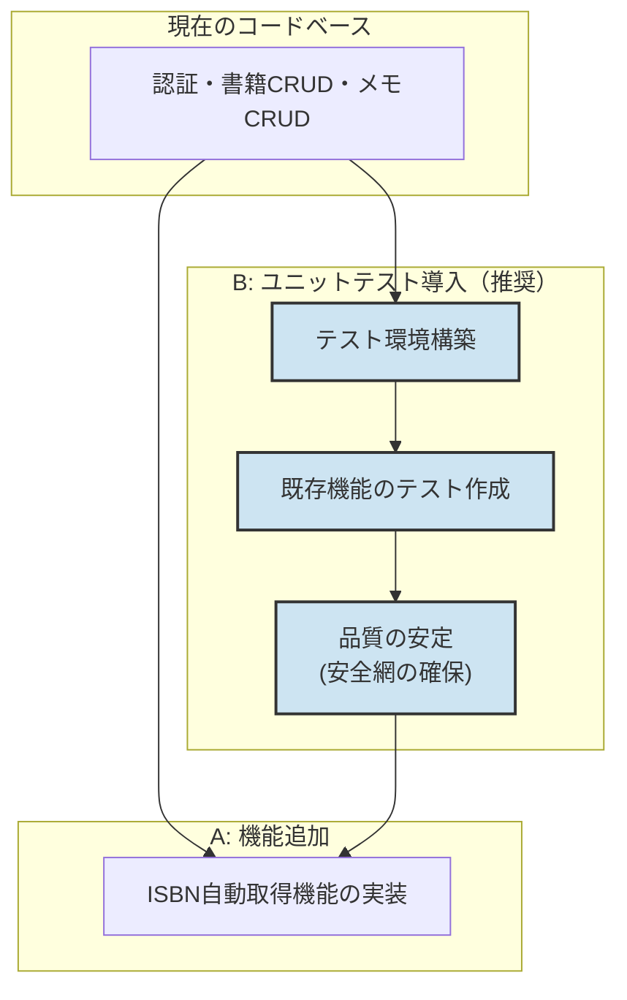

> 動作確認した。問題ないので commit と push

---

動作確認ありがとうございます！問題なく動いたとのことで安心しました。

それでは、コミットとプッシュを行いましょう。

まずは`git add`で変更をステージングします。
```bash
git add .
```
ステージングが完了しました。

次に、コミットを実行します。コミットメッセージは「feat: メモの編集・削除機能を追加」とします。
```bash
git commit -m "feat: メモの編集・削除機能を追加"
```
おっと、失礼しました。コミットメッセージが少し違いましたね。正しくは「feat: メモの編集・削除機能を追加」でした。

コミットが完了しましたので、最後にリモートリポジトリへプッシュします。
```bash
git push
```
プッシュが完了し、メモの編集・削除機能もGitHubに保存されました。順調な進捗ですね。

これで主要なCRUD（作成・読み取り・更新・削除）機能が一通り実装できました。

今後の進め方としては、引き続きUI/UXの改善を進めるか、あるいはステップ3の付加機能（全文検索など）に進むか、という選択肢があります。

**UI/UX改善の次のステップ案:**
*   `BookAdd`画面でISBNを入力したら、自動で書籍情報をAPIから取得してフォームに埋める機能。
*   各画面のローディング表示やエラー表示を、より分かりやすいコンポーネント（例: スケルトンスクリーンやアラート）に置き換える。
*   全体的なデザイン（マージン、配色など）の微調整。

**付加機能の実装案:**
*   `ARCHITECTURE.md`にも記載のある全文検索機能の実装。

どちらから進めたい、あるいは他にやりたいことはありますか？ アプリのコアな価値を高めるという点では、**ISBNからの書籍情報自動取得**はユーザーにとって非常に便利な機能になるため、個人的にはおすすめです。

---


> UI/UX改善と、機能追加のほかに、unit test で動作のテストを追加する方向もあるかと思うが、どれからすすめるのがよいか。UI/UX改善は今やっても全体機能を見たときにまた変更したくなるはずなので、機能追加か unit test ではないかと思う。

---

おっしゃる通り、非常に的確なご意見だと思います。UI/UXの改善は、主要な機能が出揃ってから全体的な視点で行う方が手戻りが少なく効率的です。

では、「機能追加（ISBNでの書籍情報自動取得）」と「ユニットテストの導入」、どちらを先に進めるべきか、それぞれのメリットを比較してみましょう。

*   **A) 機能追加（ISBN自動取得）**
    *   **メリット:** アプリの核となる利便性を大きく向上させ、ユーザーにとっての価値が明確に上がります。開発のモチベーションを維持しやすいです。
    *   **懸念点:** 新しく追加したコードにも、いずれテストは必要になります。

*   **B) ユニットテストの導入**
    *   **メリット:**
        1.  **品質の担保:** これまで作成した機能（認証、一覧、追加、詳細、編集、削除）が正しく動作し続けることをコードで保証できます。
        2.  **未来への投資:** 今後、機能追加やリファクタリングを行う際に、既存の機能を意図せず壊してしまう（デグレード）のを防ぐ「安全網」になります。
        3.  **導入の容易さ:** コードベースが比較的小さな今のうちにテストの仕組みを導入する方が、プロジェクトが巨大化してから導入するよりもはるかに簡単です。
    *   **懸念点:** ユーザーから見える価値が直接的に上がるわけではありません。

### 私の推奨

どちらも重要なステップですが、長期的な開発効率と品質を考慮すると、私としては、**このタイミングでユニットテストを導入すること**を強く推奨します。

理由は、これからISBN取得機能のような外部APIとの連携を含む複雑な機能を実装するにあたり、既存の安定した部分がテストで保護されていると、安心して新しい開発に集中できるからです。これは、今後の開発速度をむしろ加速させるための土台作りと言えます。

### 提案する進め方

もしこの方針にご同意いただけるのであれば、以下のようなステップで進めたいと思います。

1.  **テスト環境のセットアップ:** `Jest`と`React Testing Library`をプロジェクトに導入し、設定を行います。（`ARCHITECTURE.md`にも記載のある技術です）
2.  **最初のテスト作成:** まずはシンプルなコンポーネント、例えば`MemoAdd.jsx`が正しく表示されるか、といった簡単なテストケースを記述してみます。
3.  **テストの拡充:** 徐々に他のコンポーネントや、より複雑なロジックに対するテストを記述していきます。


この図のように、先にテスト(B)で土台を固めることで、その後の機能追加(A1)をより安全に進めることができます。

この方針で進めてよろしいでしょうか？